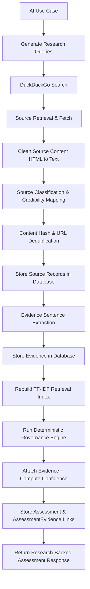

# Research Architecture

This document describes the design and implementation of the **Research, Evidence, and RAG/Retrieval Layer** added in Step 3 of the AI RiskGuard project.

---

## Technical Architecture Flow

The system processes a registered AI Use Case through a multi-stage pipeline that generates targeted search queries, retrieves public authoritative sources, cleans page content, classifies source credibility, extracts verbatim evidence sentences, indexes evidence via a local TF-IDF retriever, and attaches this evidence to support the deterministic governance score of each dimension.

---

## Detailed Pipeline Phases

### 1. Dynamic Query Generation
Instead of hardcoded queries, the `ResearchService` parses the use case name, industry, and key business nouns from the purpose/description. It generates **10 targeted search queries** (one per dimension) by matching this context with dimension-specific suffix mappings:
- **Example for Data**: `[Context] data governance requirements` or `[Context] data quality AI`
- **Example for Privacy**: `[Context] privacy data protection AI requirements`

### 2. Public Source Search
The system searches public sites using `duckduckgo-search` (a free, keyless wrapper). For safety and rate-limit friendliness, it searches up to 6 results per query and introduces a `RESEARCH_REQUEST_DELAY` (default 1.5s) between queries.

### 3. Fetching and Cleaning Content
URLs retrieved from search results are fetched asynchronously using `httpx` (with a 10-second timeout).
- Noise removal: Navigation tags, header, footer, scripts, styles, forms, and noscripts are completely stripped out using `BeautifulSoup`.
- Content limit: Cleaned plain text is truncated to `RESEARCH_CONTENT_LIMIT` (default 8000 characters) to prevent storing excessive page markup.

### 4. Source Type Classification
The `SourceClassifier` maps the URL's domain and path to one of five controlled vocabulary source types:
1. **`LAW_REGULATION`** (Credibility: 5) — Match official government legislation repositories (e.g. `legislation.gov.uk`, `eur-lex.europa.eu`).
2. **`REGULATORY_GUIDANCE`** (Credibility: 4) — Official supervisory authorities (e.g. `ftc.gov`, `sec.gov`, `ico.org.uk`, general `.gov` domains).
3. **`INDUSTRY_STANDARD`** (Credibility: 4) — Standards organisations (e.g. `iso.org`, `ieee.org`, `ietf.org`, academic `.edu` domains).
4. **`VENDOR_INFORMATION`** (Credibility: 2) — Known AI vendors (e.g. `microsoft.com`, `openai.com`, `aws.amazon.com`).
5. **`GENERAL_WEB_CONTENT`** (Credibility: 1) — Default category (blogs, news, generic websites).

### 5. Deduplication & Caching
- **URL Caching**: If the exact URL has already been fetched, the system reuses the existing `Source` record from the database.
- **Content Hash**: A SHA-256 hash of the cleaned text is computed (`content_hash`). If the same content is found under a different URL, the duplicate is skipped.

### 6. Evidence Sentence Extraction
The `EvidenceService` splits the cleaned source text into sentences and evaluates them against dimension keywords:
- Verbatim only: Only real sentences containing exact keyword hits are stored. No LLM hallucinations can occur.
- Relevancy Score: Density of keywords within the sentence determines its relevance score (0.0 to 1.0).
- Fallback Summarisation: Summaries are constructed from the leading relevant sentences of the verbatim text.

### 7. TF-IDF & Keyword Retrieval
The in-memory `TFIDFRetriever` indexes all extracted evidence.
- When an assessment is requested, it uses cosine similarity (via `scikit-learn`'s `TfidfVectorizer`) to search the evidence corpus and find the top 5 most relevant pieces of evidence for each governance dimension.
- If fewer than 3 documents are indexed, the retriever falls back to a BM25-style keyword overlap score.

### 8. Integration with Governance Engine
The evidence layer enriches but **does not alter** the deterministic scoring engine. Scoring remains rule-based and repeatable.
- Evidence counts and sources are attached to each dimension.
- Overall evidence confidence is calculated per dimension:
  - **HIGH**: 3+ evidence items with at least one high-credibility source (level >= 4).
  - **MEDIUM**: 2+ items.
  - **LOW**: 1 item.
  - **INSUFFICIENT**: No evidence found.

---

## Database Traceability

The system maintains end-to-end traceability using foreign key relationships:
- **`AIUseCase`** has many **`ResearchQuery`** records.
- **`ResearchQuery`** has many **`Evidence`** records.
- **`Source`** has many **`Evidence`** records.
- **`Assessment`** is linked to **`Evidence`** through the **`AssessmentEvidence`** join table.
- **`AssessmentResult`** links to **`Evidence`** to represent dimension-level support.
